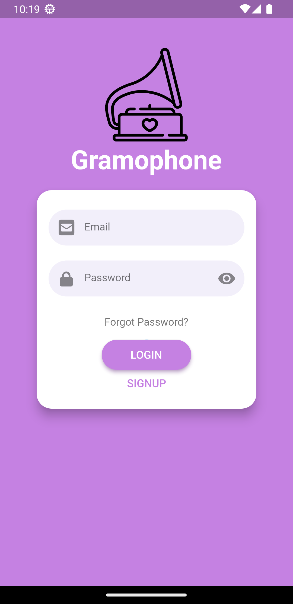
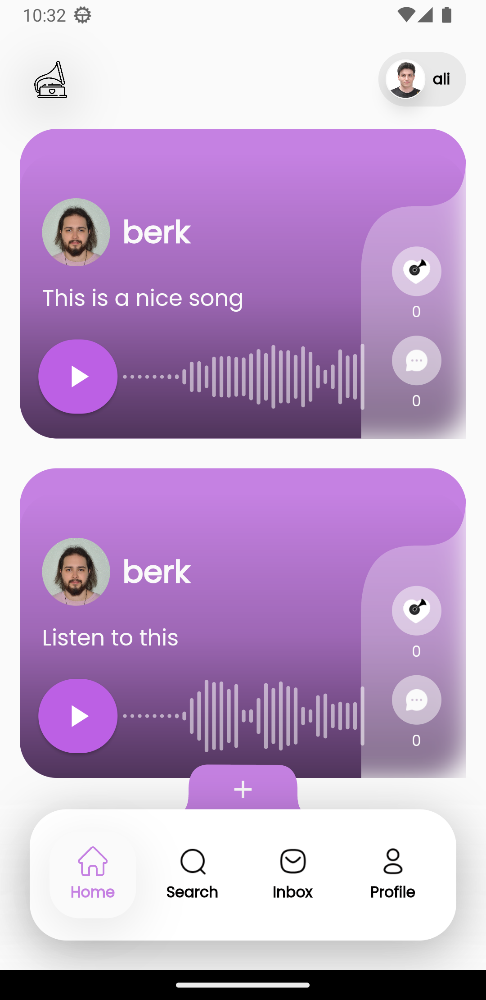
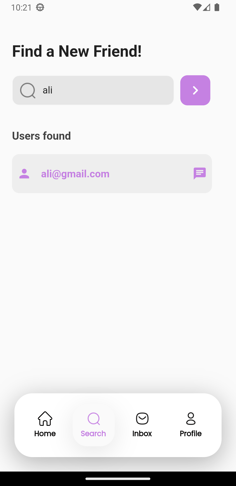
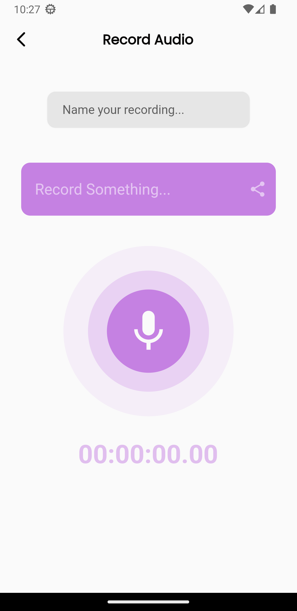
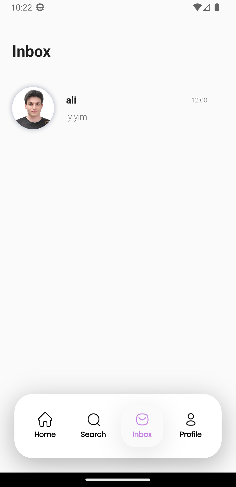
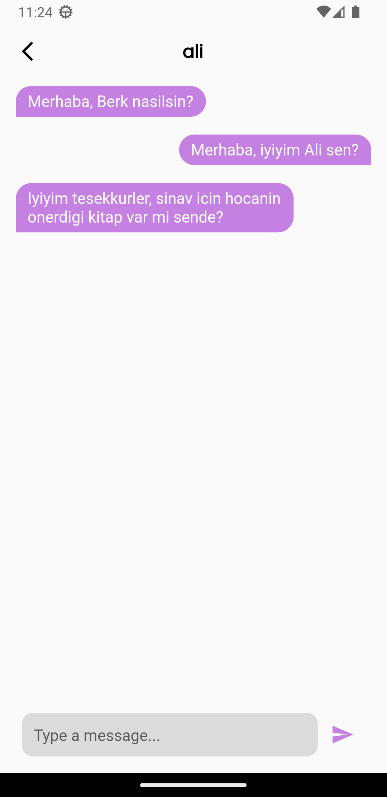
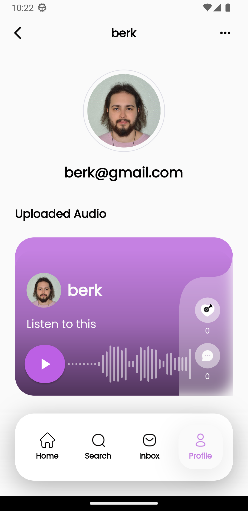
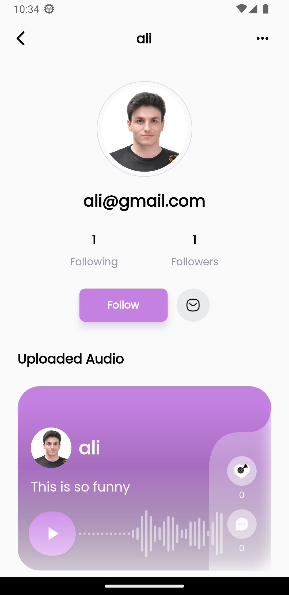
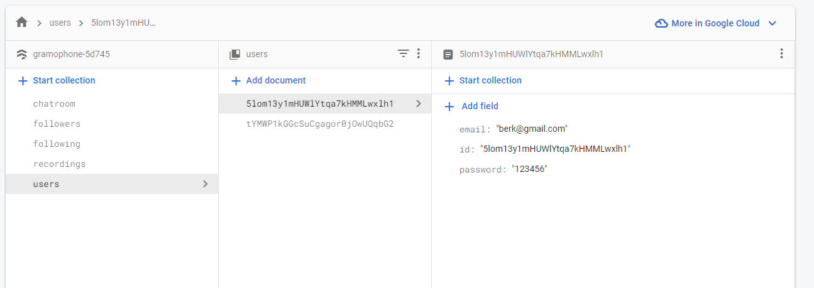

# Audio Based Social Media App

This is an audio-based social media application that aims to create a space where users can connect and share their experiences through the power of sound.
With its user-friendly interface and intuitive features, the app allows individuals to record and share audio snippets, voice memos, or even music with their friends and followers.
This app is built with Firebase, leveraging its powerful features to seamlessly combine audio sharing with a dynamic and engaging social media experience.
Firebase's real-time database functionality enables instant updates, ensuring that users can engage with the latest content and receive notifications in real-time.

----------------------------------------------------
### Here is the screenshots of the app:

  
  
   
  
  
   
  
  

_ _ _

### Here is the screenshot of the Firebase Cloud Firestore collections of the app:

  

